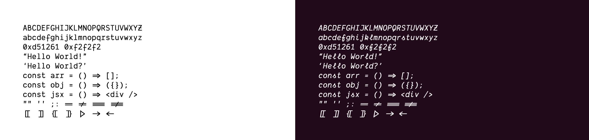

# 使用 VSCode+Markdown 打造愉悦的科技文章写作体验

## 0. 前言

Visual Studio Code（下文简称 VSCode）是微软公司开发的一款免费、功能超强的编辑器，VSCode 以其卓越的用户体验获得了“宇宙最强编辑器”的称号；Markdown 是一种轻量级标记语言，它允许人们使用易读易写的纯文本格式编写文档，并通过工具支持，转换成友好的 HTML 富文本格式供预览与导出。Markdown 已经成为事实上技术类文章写作的标准格式。

相较于传统的二进制格式文档（如 Microsoft Office Word）使用纯文本格式的优势在于方便版本控制与跟踪。Markdown 遵循了文档结构与文档展现分离的思想（即 HTML 与 CSS 的关系），写作时仅关注文档结构，通过工具在文档展现层面的支持，可以提供并不逊色于 Word 文档的阅读体验。

本文分享了使用 VSCode 编写 Markdown 文档的经验，介绍了相关工具的安装、设置与一些 Markdown 的写作技巧，希望对读者有所帮助，让我们相互交流，共同打造令人愉悦的科技文章写作体验。

## 1. 安装 WSL（Windows Subsystem Linux/只适用于 Windows 10 系统）

Windows 10 WSL 提供了轻量级、原生的 Linux 命令行环境体验。安装 WSL 的收益在于：

1. 在获得原生 Linux 命令行工具各种便利的同时，WSL 比运各种行于 Windows 之上的 Linux 虚拟机方案需要更少的系统资源（CPU、内存与磁盘存储空间）
2. 提供一致的跨平台（Windows/macOS/Linux）工作体验

访问[Windows 10 WSL 官方安装指导](https://docs.microsoft.com/en-us/windows/wsl/install-win10)完成 WSL 的安装。

下文 4.3 节提及的`file`命令即可在 WSL 环境中运行，免去使用其他图形化界面带来的不便。

## 2. 安装 VSCode 与相关插件

### 2.1 安装 VSCode

访问[VSCode 官方网站](https://code.visualstudio.com/)，下载并完成安装。

### 2.2 验证命令行工具`code`的可用性

VSCode 提供了命令行工具`code`可以便捷的打开文件与目录，为了验证`code`命令的可用性，打开系统的命令行工具（如 Windows 系统中的 Command Prompt/PowerShell/WSL；macOS 中的 Terminal/iTerm 2）输入以下命令：

```bash
code [path-to-file-or-directory]
```

如果 VSCode 成功启动并打开命令行中`path-to-file-or-directory`所指定的文件或目录，则说明`code`命令可以正常工作。使用 macOS 的用户可能需要根据[VSCode on macOS](https://code.visualstudio.com/docs/setup/mac)的指引，完成`code`命令的设置。

### 2.3 安装 VSCode 插件

打开 VSCode，定位到插件搜索与安装窗口


完成以下插件的安装与配置

#### 1.3.1 Prettier


使用自动化格式工具可以**保证多份文档的格式严格一致，保证了书写风格的统一**。Prettier 是一款深受欢迎的代码格式化工具，主要用来格式化 JavaScript/TypeScript/JSON 源文件，Prettier 也能够格式化 Markdown 文件。Prettier 安装完成后，在 VSCode 中使用键盘组合`Ctrl+,`（macOS 使用`Command+,`）呼出 VSCode 设置页面，并点击`{}`按钮将页面切换为基于 JSON 文件（`settings.json`）的配置方式：


设置文档保存时自动格式化选项：

```json
{
  ...
  "editor.formatOnSave": true,
  ...
}
```

完成该设置后，每次保存 Markdown 文件时，Prettier 将会自动对文件进行格式化。

#### 1.3.2 Markdown All in One


Markdown All in One 提供了 ToC（Table of Contents）生成，自动编辑，LaTeX 公式支持等便捷功能。

## 3. 自定义视觉体验

### 3.1 VSCode 色彩主题（Color Theme）

可以在 VSCode 中的插件页，通过关键字`Light Theme`/`Dark Theme`搜索 VSCode 浅色/深色的色彩主题。推荐以下主题：

- Light Theme: `Blue Light Theme`（内置主题）
- Dark Theme: `Capo-Dark`（内置主题）
- [Night Owl](https://github.com/sdras/night-owl-vscode-theme)

### 3.2 VSCode 文件图标主题（Icon Theme）

可以在 VSCode 中的插件页，通过关键字`Icon Theme`搜索文件图标主题。推荐`Material Icon Theme`。

### 3.3 支持合字（ligatures）的字体

支持合字字体的出现，给编码开发/科技写作带来了不一样的体验，下图直观的展现了支持合字字体的视觉感受：


支持合字的字体有：

- [Fira Code](https://github.com/tonsky/FiraCode)（免费）
- [Hasklig](https://github.com/i-tu/Hasklig)（免费）
- [Monoid](https://larsenwork.com/monoid/)（免费）
- [Iosevka](https://github.com/be5invis/Iosevka)（免费）
- [Dank Mono](https://dank.sh/)（付费）

下载并安装相应字体后，打开 VSCode `settings.json`配置文件（参见 1.3.1 节），对字体字号进行设置，以设置`18`字号的`FiraCode`字体为例，配置文件中应指定：

```json
{
  // ...
  "editor.fontFamily": "Fira Code",
  "editor.fontSize": 18
  // ...
}
```

需要注意的是，如果选用了`Dank Mono`字体，并且要展现官网展示的关键字手写斜体效果，



## 4. 使用 Markdown 写作

Markdown 的基本元素非常简明直白，参考这篇三分钟的[Mastering Markdown](https://guides.github.com/features/mastering-markdown/)教程即可快速上手 Markdown 写作。本章介绍一些 Markdown 写作技巧。

### 4.1 等宽字体与程序语法高亮

#### 4.1.1 内嵌方式

在普通行文（通常由非等宽字体组成）中，可以通过\`\`插入等宽字体，比如：我们可以通过`docker container ls`命令获得系统中当前运行的所有容器。

#### 4.1.2 多行方式与程序语法高亮

在引述较大片段样例代码时可以通过嵌入多行等宽字体的方式对代码片段进行展示，比如引用以下 JavaScript 代码片段：

```js
const button = document.getElementById("button");
const clicks = Observable.fromEvent(button, "click");

const projection = function (ev) {
  console.log(ev);
  return ev.clientX;
};

clicks.map(projection).subscribe({
  next: console.log,
});
```

如果要获得特定语言的程序语法高亮效果，可以在等宽自己片段开始处指定编程语言，像这样：

````
​```javascript
​```
````

甚至也可以使用特定编程语言的简写：

````
​```js
​```
````

都可以获得以下的语法高亮效果：

```js
const button = document.getElementById("button");
const clicks = Observable.fromEvent(button, "click");

const projection = function (ev) {
  console.log(ev);
  return ev.clientX;
};

clicks.map(projection).subscribe({
  next: console.log,
});
```

对于 VSCode 没有内建支持的语法高亮效果，比如 Dockerfile 中的指令，通过安装相应的插件，比如 Docker，也可以获得语法高亮效果


```dockerfile
FROM openjdk:8u191-jre-alpine3.9
ARG jar_file
WORKDIR /app
COPY target/$jar_file /app/
EXPOSE 8080
ENV jar_file=$jar_file
CMD java -jar $jar_file
```

### 4.2 引述

在引用参考材料的大段文字时可以使用符号`>`，必须以下实例就综合了链接与文字引述的语法：

关于密码学中的 nounce，[维基百科](https://zh.wikipedia.org/wiki/Nonce)给出了如下定义：

> 在信息安全中，Nonce 是一个在加密通信只能使用一次的数字。在认证协议中，它往往是一个随机或伪随机数，以避免重放攻击。Nonce 也用于流密码以确保安全。如果需要使用相同的密钥加密一个以上的消息，就需要 Nonce 来确保不同的消息与该密钥加密的密钥流不同。

### 4.3 设置图片大小

在引用图片时，有时会出现图片过大，需要调整其尺寸以适应当前窗口以及最终文档页面的大小的情况，可以通过安装`Markdown Image Size`插件来解决：


我们可以通过 Linux 提供的`file`命令方便的获取图片的尺寸，以 1.3.1 节中 Prettier 插件信息图片为例，首先通过`file`命令获取其尺寸：


如果要将该图片的显示大小缩减为原始尺寸的 1/4（长宽各减半），可以做如下设定：

```

```

需要注意的是，`Markdown Image Size`只支持整数形式的图片尺寸，以下设定是无效的（预览时将显示图片的原始尺寸）：

```

```

### 4.4 数学公式

与 4.1 节 等宽字体与程序语法高亮类似，在 VSCode 的 Markdown 文档中，也可以指定内嵌或多行 LaTeX 公式。可以通过`$...$`内嵌单行 LaTeX 公式，可以通过以下形式书写多行 LaTeX 公式

```
$$
...
$$
```

以下示例综合了单行与多行 LeTeX 公式的内容的编写。

ECDSA 的签名为 40 字节，由两部分组成，记为：

$$
Sig = (r, s)
$$

其中$r$和$s$各 20 字节。首先计算$r$：选择随机数$v$（一次性私钥），并根据生成点$G$和椭圆曲线的乘法公式获得椭圆曲线上的一点$P$：

$$
Q = q*G = (x, y)
$$

P 点的 x 坐标即为$r$：

$$
r = x
$$

之后计算$s$。第一步，对交易（事件/消息）进行 Keccak256 摘要，其结果记为$z$：

$$
z = Keccak256(m)
$$

并使用私钥$k$、消息摘要值$z$和之前获得的$r$生成$s$：

$$
s = q^{-1}*(z + k * r) \bmod p
$$

将$r$和$s$包含于交易中供验证。

#### 4.4.1 LaTeX 公式参考手册

参见[LaTeX/Mathematics](https://en.wikibooks.org/wiki/LaTeX/Mathematics)。

### 4.5 综合应用

Markdown 语法简洁、清晰。只需要多加练习，一定可以快速掌握。这篇文章本身综合了使用 Markdown 编写科技文章的多个要素，可作为综合应用的参考。

## 5. 预览与导出

### 5.1 预览

通过`Ctrl+Shift+P`（macOS 为`Command+Shift+P`）呼出 VSCode 的 Command Pallet，键入`preview`调用 Markdown All in One 插件的预览功能


### 5.2 导出

安装`Markdown PDF`插件


通过`Ctrl+Shift+P`（macOS 为`Command+Shift+P`）呼出 VSCode 的 Command Pallet，键入`pdf`即可调用 Markdown PDF 插件支持的各种格式的导出功能


#### 5.2.1 注意事项

Markdown PDF 插件不支持以下 Markdown 特性的导出：

- 自定义图片尺寸
- LaTeX 公式

对于图片尺寸的支持，可以采用 HTML 的`` tag 替代 Markdown 的图片语法：

```html

```

```html

```

```html

```

对于 LaTeX 公式的导出支持，可以通过安装[Typora](https://typora.io/)来解决。在 Typora 的设置相中勾选 Markdown 选项中 Syntax Support 的 Inline Math 选项：

如果不想切换工具，寻求在 VSCode 解决 LaTeX 无法在导出的 PDF 中正常显示的问题，可以参考[该 Github Issue](https://github.com/yzane/vscode-markdown-pdf/issues/21)，在 Markdown 文档中添加以下代码片段：
·


设置完成后，通过 Typora 的`File->Export`菜单项导出目标格式的文档。

```html
<script
  type="text/javascript"
  src="http://cdn.mathjax.org/mathjax/latest/MathJax.js?config=TeX-AMS-MML_HTMLorMML"
></script>
<script type="text/x-mathjax-config">
  MathJax.Hub.Config({ tex2jax: {inlineMath: [['$', '$']]}, messageStyle: "none" });
</script>
```

## 6. Markdown 与 Terminal 的集成

如果 Markdown 文件中有命令行片段：

```sh
kubectl apply -f res/02-hello-go-insufficient-mem.yaml
watch kubectl get pods
```

每次执行命令时都需要复制粘贴需要执行的命令非常不便，通过自定义用户按键映射来提高 Markdown 文档与命令行终端的无缝集成体验。

打开键盘快捷键配置：


自定义如下快捷键：


以上配置达到的效果是：

- 通过`` Ctrl+` ``完成 Markdown 编辑区和命令行终端的切换
- 通过`Ctrl+Enter`执行当前行或当选选中的命令
